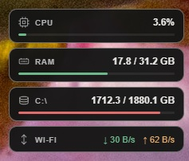
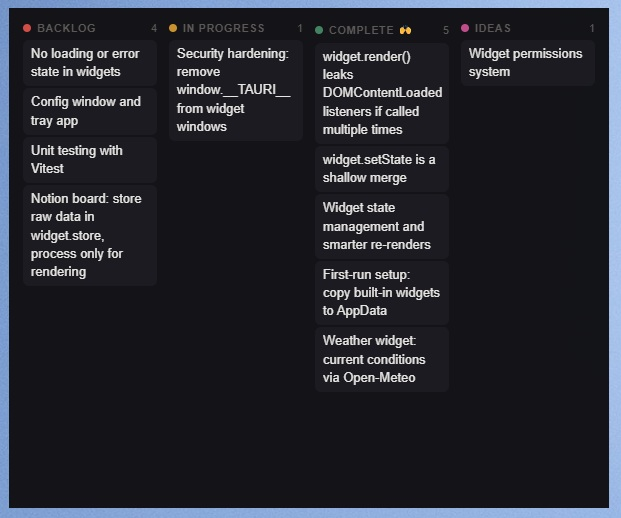

<div align="center">


# Luna Widgets

</div>

A lightweight desktop widget platform built with Tauri 2. Widgets are Mustache templates, CSS, and JavaScript. No framework, no build step, no boilerplate. Drop a folder into the app's widgets directory, reload the widgets, and the new one appears on your desktop.


## Features

- **Platforms** — Windows, macOS, and Linux ([partial support](#linux-support))
- **Widget platform** — load any number of self-contained widgets from a directory
- **Mustache templates** — declarative HTML templates with automatic re-rendering
- **Always-on-bottom** — widgets sit behind all other windows like wallpaper
- **Ctrl+drag** — reposition any widget by holding Ctrl and dragging
- **Position persistence** — window positions and sizes are saved across restarts
- **Live reload** — reload all widgets from the tray without restarting the app
- **Configurable refresh rate** — set the polling interval per widget via `onRefresh(fn, delay)` or `updateInterval` in `config.json`
- **Smart re-rendering** — DOM diffing via morphdom, only changed nodes are updated
- **System stats** — built-in API to read CPU, RAM, disk, and network usage
- **System tray** — reload all widgets or quit from the tray icon
- **Tiny footprint** — uses the system WebView, no bundled Chromium

## Example Widgets

Luna Widgets ships with four built-in widgets to use as a starting point.

### Clock

A minimal clock with date display.


### Weather

Current conditions via [Open-Meteo](https://open-meteo.com/) — no API key required. Configure your location in `config.json`.


### System Monitor

Live CPU, RAM, disk, and network usage.



### Notion Board

A Kanban board synced to a Notion database. Supports drag-and-drop to move items between columns.



## Linux Support

Linux is partially supported. The app runs and widgets work, but there are known limitations depending on the display server.

Tested on GNOME Wayland (Ubuntu 24.04):

- Widgets load and run ✓
- Size saving ✓
- Always-on-bottom ✗ — GNOME does not support the wlr-layer-shell protocol
- Position saving ✗ — Wayland does not allow apps to set arbitrary window positions by design

X11 and wlroots-based compositors (Sway, Hyprland) should work better based on how the code is structured, but have not been tested yet.

Full Linux support is planned after the first release.

### Linux Build Dependencies

```bash
sudo apt install libwebkit2gtk-4.1-dev build-essential curl wget file \
  libssl-dev libayatana-appindicator3-dev librsvg2-dev libgtk-layer-shell-dev
```

## (Possible) Future Features

- First-run setup and onboarding
- Config UI — manage and configure widgets from a settings window
- Widget permissions — restrict which APIs each widget can access
- Full Linux support — always-on-bottom and position saving on GNOME Wayland

## Prerequisites

- [Bun](https://bun.sh/) (v1.0+)
- [Rust](https://rustup.rs/) (stable)
- **Windows**: WebView2 (included with Windows 11)
- **macOS**: Xcode Command Line Tools — `xcode-select --install`
- **Linux**: see [Linux Build Dependencies](#linux-build-dependencies)

## Running

```bash
bun install
bun run tauri dev
```

```bash
# Production build
bun run tauri build
```

## Widgets Directory

Widgets are loaded from the app's data directory:

| Platform | Path                                                          |
| -------- | ------------------------------------------------------------- |
| Windows  | `%APPDATA%\com.luna-widgets.app\widgets\`                     |
| macOS    | `~/Library/Application Support/com.luna-widgets.app/widgets/` |
| Linux    | `~/.local/share/com.luna-widgets.app/widgets/`                |

Each subdirectory is a widget. The app loads all of them on startup.

## Creating a Widget

A widget is a folder with the following files:

```
my-widget/
├── widget.json         # required — manifest
├── widget.js           # required — logic
├── template.mustache   # recommended — HTML template
├── style.css           # recommended — styles
└── config.json         # optional — user config
```

### widget.json

Controls the window appearance:

```json
{
  "name": "My Widget",
  "width": 300,
  "height": 200,
  "resizable": false,
  "transparent": true,
  "decorations": false
}
```

| Field         | Type    | Default  | Description                       |
| ------------- | ------- | -------- | --------------------------------- |
| `name`        | string  | `Widget` | Window title                      |
| `width`       | number  | —        | Initial width in pixels           |
| `height`      | number  | —        | Initial height in pixels          |
| `resizable`   | boolean | `true`   | Whether the window can be resized |
| `transparent` | boolean | `false`  | Transparent window background     |
| `decorations` | boolean | `true`   | Show native window title bar      |

> Changes to `widget.json` require a full app restart to take effect. All other files (`widget.js`, `template.mustache`, `style.css`, `config.json`) are picked up by **Reload Widgets** in the tray.

### template.mustache

The HTML content rendered inside `#app`. Uses [Mustache](https://mustache.github.io/) syntax — variables from `widget.setState` are available directly:

```mustache
<div class="card">
  <h1>{{title}}</h1>
  <p>{{description}}</p>
  {{#items}}
  <div class="item">{{name}}</div>
  {{/items}}
</div>
```

### style.css

Standard CSS. Loaded automatically — no `<link>` tag needed. Target `body` and `#app` for layout:

```css
body {
  background: transparent;
  font-family: sans-serif;
  color: white;
}

#app {
  height: 100%;
}
```

### widget.js

The logic layer. Has access to the `widget` API and `Mustache` globally.

#### `widget.store`

A reactive state object. Assigning to it or mutating any property automatically triggers a re-render via DOM diffing — only changed nodes are updated.

Replace the whole store at once:

```js
widget.store = { time: '12:00', day: 'Monday' };
```

Or update a single property:

```js
widget.store.time = '12:01'; // only re-renders what changed
```

Multiple synchronous assignments are batched into a single render:

```js
widget.store.time = '12:01';
widget.store.day = 'Tuesday';
// → one render, not two
```

The store is deeply reactive — nested objects and arrays trigger renders when mutated too:

```js
widget.store.items[0].name = 'updated'; // triggers render
```

#### `widget.renderWithCallback(fn)`

By default, rendering is automatic — no setup needed. Call this only if you need to run code after each render, such as re-attaching event listeners:

```js
widget.renderWithCallback(() => {
  attachEventListeners();
});
```

#### `widget.onRefresh(fn, delay?)`

Calls `fn` immediately and then on a repeating interval. `delay` is in milliseconds and defaults to `window.__config.updateInterval ?? 500`. Use this for polling external data:

```js
widget.onRefresh(async () => {
  const res = await widget.fetch('https://api.example.com/data');
  const data = await res.json();
  widget.store = { title: data.title };
}, 30000); // poll every 30 seconds
```

#### `widget.fetch(url, options?)`

Proxies HTTP requests through the Rust backend, bypassing CORS restrictions:

```js
const res = await widget.fetch('https://api.example.com/data', {
  method: 'POST',
  headers: { Authorization: 'Bearer token' },
  body: JSON.stringify({ key: 'value' }),
});
const data = await res.json();
```

#### `widget.action(name, payload)` / `widget.onAction(name, fn)`

Communication channel for user interactions in the template back to widget.js:

```js
// widget.js
widget.onAction('increment', ({ amount }) => {
  widget.store.count += amount;
});

// template.mustache (via inline onclick or attached listener)
widget.action('increment', { amount: 1 });
```

#### `window.__config`

Values from `config.json` are available as `window.__config`:

```json
// config.json
{
  "apiKey": "abc123",
  "refreshRate": 10000
}
```

```js
// widget.js
const { apiKey } = window.__config;
```

### Minimal example

**widget.json**

```json
{
  "name": "Clock",
  "width": 200,
  "height": 80,
  "transparent": true,
  "decorations": false
}
```

**template.mustache**

```mustache
<span>{{time}}</span>
```

**style.css**

```css
body {
  background: transparent;
  color: white;
  font-size: 48px;
  display: flex;
  align-items: center;
  justify-content: center;
  height: 100%;
}
```

**widget.js**

```js
widget.onRefresh(() => {
  widget.store = {
    time: new Date().toLocaleTimeString([], { hour: '2-digit', minute: '2-digit' }),
  };
}, 1000);
```

## Project Structure

```
notion-widget/
├── src/                    # React shell (for future config UI)
│   ├── App.tsx
│   └── styles/global.css
├── src-tauri/
│   ├── src/
│   │   ├── lib.rs          # Widget loader, widget API, tray
│   │   └── main.rs
│   ├── capabilities/
│   │   └── template.json   # Permissions for widget windows
│   ├── mustache.min.js     # Bundled at compile time via include_str!
│   ├── Cargo.toml
│   └── tauri.conf.json
├── widgets/                # Built-in example widgets
│   ├── clock/
│   ├── system/
│   └── notion-board/
├── package.json
└── vite.config.ts
```
